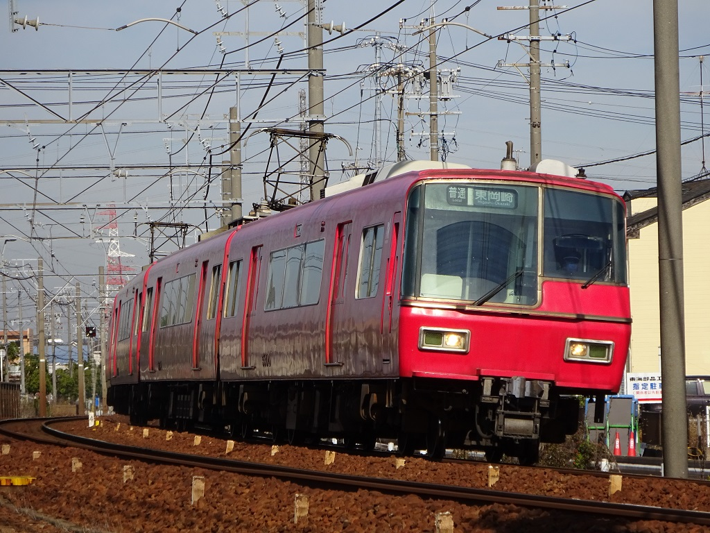

= Bveデータ置き場（準備中）

== はじめに
ここにTn(twitter:@Tn_E235)が制作したBveデータを公開します。
利用の際は次に示す利用規約を守ってください。

== 利用規約
路線データ::
てきすと

車両データ::
てきすと

車両パネルデータ::
てきすと

プラグイン::
てきすと

== 公開データ一覧
[[route]]
* 路線データ
** 名鉄名古屋本線 知立→豊明(神宮前)
** 名鉄三河線 知立→豊田市

[[train]]
* 車両データ
** 名鉄6000系

[[train_panel]]
* 車両パネルデータ
** 名鉄9500系

[[ats_pulgin]]
* プラグイン
** M式ATSプラグイン
** TICSプラグイン
** 電車でGO!!プラグイン

